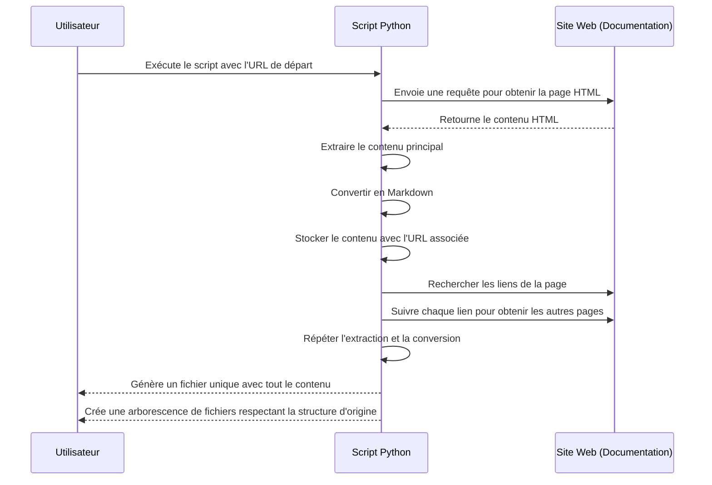

# Documentation Crawler & Converter

Ce projet est un crawler Python conçu pour extraire le contenu de pages de documentation en HTML et les convertir au format Markdown. Il offre deux modes de sortie : un fichier unique contenant toute la documentation et une arborescence de fichiers qui respecte la structure de la documentation d'origine.

Il est particulièrement utile pour pouvoir alimenter les GPTs en contexte et donc être plus pertinent.

## Fonctionnalités

- **Extraction de contenu principal :** Le script identifie et extrait le contenu principal de chaque page, en évitant les menus, en-têtes et pieds de page.
- **Conversion en Markdown :** Après extraction, le contenu est converti en Markdown pour être consultable dans des fichiers texte.
- **Double mode de sortie :**
  - **Fichier unique :** Tout le contenu extrait est regroupé dans un seul fichier, permettant une consultation fluide de toute la documentation.
  - **Arborescence de fichiers :** Chaque page extraite est également enregistrée dans un fichier individuel, conservant la structure originale de la documentation.
- **Suivi intelligent des liens :** Le script analyse les liens internes pour naviguer entre les pages de la documentation tout en restant dans le même domaine.

## Exécution en local

- Installer un environnement virtuel et installer les librairies

```bash
pip install virtualenv
virtualenv -p python3 myenv
source myenv/bin/activate
pip install -r requirements.txt
pip freeze > requirements.txt
pip install --upgrade -r requirements.txt
```

- Exécuter script.py

## Schéma de fonctionnement

Voici un diagramme de séquence illustrant le fonctionnement du script, de la collecte de contenu à sa conversion en Markdown.



## Structure du Projet

- `src/script.py` : Script principal qui effectue le crawling et la conversion.
- `extract/` : Répertoire contenant les fichiers de sortie générés :
  - `*.md` : Fichier Markdown unique contenant l'intégralité de la documentation.
  - `*_tree/` : Répertoire contenant l'arborescence de fichiers individuels.
- `README.md` : Documentation du projet.

## Utilisation

Pour lancer le script avec vos propres paramètres, modifiez les variables suivantes dans `script.py` :

```python
START_URL = "https://docs.github.com/fr/actions"  # L'URL de départ pour le crawling
FILE_NAME_OUTPUT = "extract/githubactions.md"     # Chemin du fichier unique de sortie
TREE_OUTPUT_DIR = "extract/githubactions_tree"    # Chemin du dossier pour l'arborescence
```

## Notes

- **Respect des politiques du site** : Assurez-vous de respecter les politiques de chaque site que vous parcourez. Ce script est destiné à être utilisé pour la sauvegarde ou l'archivage de documentation avec autorisation.
- **Organisation des sections** : Les sections sont ajoutées dans l'ordre de crawling. Pour personnaliser cet ordre, vous pouvez ajuster le script en fonction de votre structure préférée.

## Contribuer

Les contributions sont les bienvenues ! N'hésitez pas à soumettre des demandes d'ajout de fonctionnalités, des suggestions d'améliorations ou des corrections de bogues.

---

**Licence** : Ce projet est distribué sous une licence MIT. Veuillez consulter le fichier `LICENSE` pour plus de détails.
