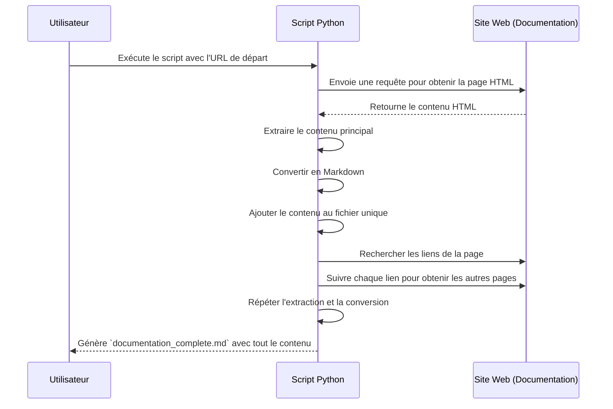

# Documentation Crawler & Converter

Ce projet est un crawler Python conçu pour extraire le contenu de pages de documentation en HTML et les convertir en un fichier unique au format Markdown.

Il est particulièrement utile pour pouvoir alimenter les GPTs en contexte et donc etre plus pertinent.

## Fonctionnalités

- **Extraction de contenu principal:** Le script identifie et extrait le contenu principal de chaque page, en évitant les menus, en-têtes et pieds de page.
- **Conversion en Markdown :** Après extraction, le contenu est converti en Markdown pour être consultable dans un fichier texte.
- **Consolidation dans un seul fichier :** Tout le contenu extrait est regroupé dans un fichier `documentation_complete.md`, permettant une consultation fluide de toute la documentation.

## Executer en local

- installer un environnement virtuel et installer les librairies

```bash
pip install virtualenv
virtualenv -p python3 myenv
source myenv/bin/activate
pip install -r requirements.txt
pip freeze > requirements.txt
pip install --upgrade -r requirements.txt
```

- executer script.py

## Schéma de fonctionnement

Voici un diagramme de séquence illustrant le fonctionnement du script, de la collecte de contenu à sa conversion en Markdown.



## Structure du Projet

- `crawl_docs.py`: Script principal qui effectue le crawling et la conversion.
- `documentation_complete.md`: Fichier Markdown généré contenant l'intégralité de la documentation récupérée.
- `README.md`: Documentation du projet.

## Notes

- **Respect des politiques du site** : Assurez-vous de respecter les politiques de chaque site que vous parcourez. Ce script est destiné à être utilisé pour la sauvegarde ou l'archivage de documentation avec autorisation.
- **Organisation des sections** : Les sections sont ajoutées dans l'ordre de crawling. Pour personnaliser cet ordre, vous pouvez ajuster le script en fonction de votre structure préférée.

## Contribuer

Les contributions sont les bienvenues ! N'hésitez pas à soumettre des demandes d'ajout de fonctionnalités, des suggestions d'améliorations ou des corrections de bogues.

---

**Licence** : Ce projet est distribué sous une licence MIT. Veuillez consulter le fichier `LICENSE` pour plus de détails.
